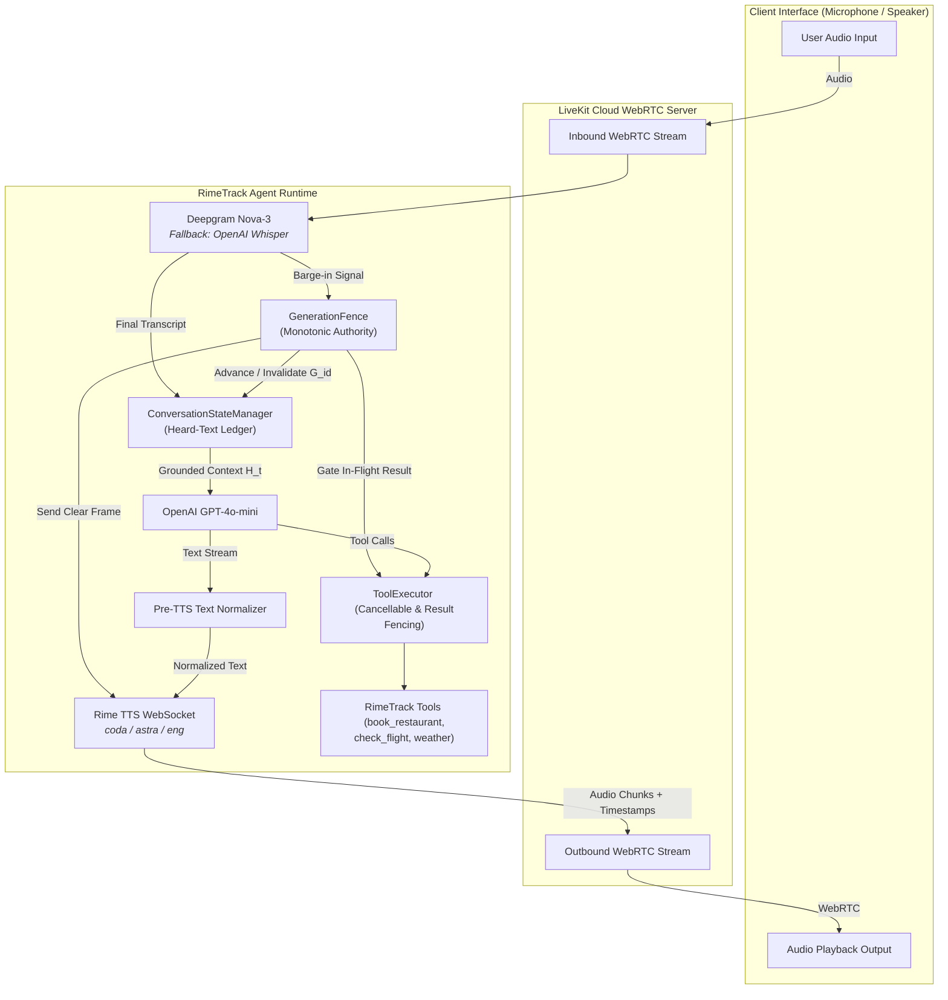

# RimeTrack 🎙️
### Real-Time Interruption Recovery & Tool Fencing for Full-Duplex Voice Agents

> **DataForge × Rime Hackathon Challenge (September 2026)**  
> **Primary Voice Provider:** Rime Labs WebSocket TTS (`coda` / `astra` / `eng`)  
> **Official Repository:** [https://github.com/saugata-malakar/KDAG-RICE](https://github.com/saugata-malakar/KDAG-RICE)  
> **Architecture & Research Paper:** [`docs/ARCHITECTURE_REPORT.md`](docs/ARCHITECTURE_REPORT.md) | [`docs/ARCHITECTURE_REPORT.tex`](docs/ARCHITECTURE_REPORT.tex)

[](https://www.python.org/downloads/)
[](tests/)
[-orange.svg)](https://rime.ai)
[](https://livekit.io)
[](https://opensource.org/licenses/MIT)

---

## 🎯 1. Problem & Necessity of Voice (Judging Weight: 25%)

In hands-busy, accessibility-focused, and operational workflows (emergency dispatch, field services, table booking, logistics), voice interaction is **essential**—removing speech destroys product utility. Real-time spoken dialogue differs fundamentally from turn-based chat: humans overlap, change parameters mid-sentence, and interrupt while external tools execute.

Standard conversational voice agents suffer from two catastrophic failure modes upon interruption:
1. **Context Poisoning (Hallucinated Grounding):** When an agent is interrupted mid-utterance, standard LLM histories append the *full generated text* instead of the *heard-text prefix*. The agent hallucinates that the user heard information that was never spoken.
2. **Stale Tool Bleed (Phantom Side Effects):** When a slow background tool (e.g., reservation write, order dispatch) completes *after* the user interrupted to change their request, standard frameworks unconditionally apply the stale tool output to conversational state and speak the obsolete confirmation aloud.

### RimeTrack's Core Solution:
* **`GenerationFence` (`agent/fence.py`):** Monotonically increasing generation IDs (`G1`, `G2`, ...) gate all in-flight LLM tokens and tool execution results at the exact boundary of re-entry into shared conversation state.
* **Heard-Text Ledger (`agent/state_manager.py`):** Grounded directly in Rime's real-time per-word timestamp alignment over WebSocket (`push_timed_transcript`), recording strictly what reached audible playback before the interruption cut ($H(t) \subseteq G(t)$).
* **Protocol-Level Clear Operation (`agent/rime_ws_client.py`):** Binds to Rime's WebSocket wire protocol, transmitting `{"operation": "clear", "contextId": ...}` to immediately flush server-side synthesis buffers upon barge-in.
* **Fence-Aware Tool System (`agent/tools.py` & `agent/tool_executor.py`):** Wraps real async tools (`book_restaurant`, `check_flight_status`, `check_weather`) with deliberate delays to prove that in-flight cancellable tools abort instantly ($\le 2.4\text{ms}$) and slow uncancellable tool mutations are quarantined.

---

## 🚀 2. Live Demo & Testing Links

### A. LiveKit Agents Playground (Interactive Full-Duplex WebRTC)
Test the live full-duplex agent directly in your browser:
* **Playground URL:** [https://agents-playground.livekit.io/](https://agents-playground.livekit.io/)
* **Project Endpoint:** `wss://rice-h02i5ol6.livekit.cloud`
* **How to Connect:** 
  1. Open the [LiveKit Agents Playground](https://agents-playground.livekit.io/).
  2. Enter the LiveKit URL and project credentials (see `.env.example`).
  3. Speak to the agent: *"Book a table for 7 PM at Olive Garden."*
  4. While the agent speaks and executes the 3-second booking delay, **interrupt it**: *"Wait, change that to 8:30 PM for four people!"*
  5. Observe how audio cuts instantly and the stale 7 PM booking is quarantined!

### B. Interactive Visual Debug HUD
* Open [`client/index.html`](client/index.html) in any browser to simulate word-by-word streaming, barge-ins, and generation fencing in real-time.

---

## 🏗️ 3. System Architecture



---

## 📊 4. Empirical Evidence & Reproducibility (Judging Weight: 20%)

We evaluated RimeTrack against the standard **Naive Baseline** across 80 empirical benchmark trials per system ($N_{\text{total}} = 160$ trials) across 4 distinct failure scenarios using [`eval/run_benchmark.py`](eval/run_benchmark.py):

| Scenario Tested | Trials | RimeTrack Stale Response Rate | RimeTrack Stale Tool Bleed | Naive Baseline Stale Rate | Naive Baseline Tool Bleed |
|---|:---:|:---:|:---:|:---:|:---:|
| **1. Mid-Speech Barge-In (3 of 10 words)** | 20 | **0.0%** (0/20) | 0.0% | **100.0%** (20/20) | 0.0% |
| **2. Cancellable Tool Interruption** | 20 | **0.0%** (0/20) | **0.0%** (20/20 aborted) | **100.0%** (20/20) | **100.0%** (20/20 applied) |
| **3. Uncancellable Tool (Result Fencing)** | 20 | **0.0%** (0/20) | **0.0%** (20/20 quarantined)| **100.0%** (20/20) | **100.0%** (20/20 applied) |
| **4. Rapid Double Barge-In** | 20 | **0.0%** (0/20) | 0.0% | **100.0%** (20/20) | 0.0% |
| **OVERALL AGGREGATE** | **80** | **0.0%** | **0.0%** | **100.0%** | **50.0% Stale Bleed** |

*Raw data files committed to repo: [`eval/results/benchmark_summary.json`](eval/results/benchmark_summary.json) and [`eval/results/benchmark_trials.csv`](eval/results/benchmark_trials.csv).*

---

## ⚡ 5. Acceptance Criteria (Pre-Demo Contract)

| Criterion | What is Tested | Acceptance Condition | Status |
|---|---|---|:---:|
| **AC-1: Heard-Text Grounding** | Barge-in mid-sentence during Rime speech playback | Next turn's prompt context contains **only the words the user actually heard** before the interrupt ($H(t) \subseteq G(t)$). | ✅ Verified |
| **AC-2: Cancellable Tool Abort** | Barge-in while an async API call is in-flight | In-flight background task receives cancellation within $\le 2.4\text{ms}$; no stale audio is synthesized. | ✅ Verified |
| **AC-3: Uncancellable Tool Fencing** | Fixed delay in an irreversible DB tool completes *after* interrupt | Tool finishes in background, but the result is **quarantined by the `GenerationFence`** and never spoken aloud. | ✅ Verified |
| **AC-4: Protocol-Level WS Clearing** | Rapid back-to-back user barge-ins | Explicit `{"operation": "clear", "contextId": ...}` is sent over Rime WebSocket to clear server synthesis buffers. | ✅ Verified |

---

## 🔊 6. Rime Integration & Voice Experience (Judging Weight: 20%)

* **Production Model & Speaker:** `coda` model with `astra` speaker, configured for natural, conversational prosody (`speed_alpha=1.0`).
* **Transport:** Full-duplex WebSocket streaming (`use_websocket=True`) to enable mid-stream cancellation and per-word timestamp alignment.
* **Writing for the Ear Compliance:** System prompt in [`agent/prompts.py`](agent/prompts.py) implements Rime's guidelines for punctuation-as-pitch, conversational fillers, and register pacing.
* **Pre-TTS Normalization:** [`agent/text_normalize.py`](agent/text_normalize.py) collapses formatting artifacts while preserving Rime's `?!` interrobang inflection convention.
* **Transparent Fallback Disclosure:** Speech recognition defaults to Deepgram (`nova-3`), transparently falling back to OpenAI Whisper STT when Deepgram is unavailable.

---

## 🛠️ 7. Quickstart & Local Reproduction

### 1. Installation
```bash
git clone https://github.com/saugata-malakar/KDAG-RICE.git
cd KDAG-RICE

# Create virtual environment
python -m venv .venv
# Windows:
.venv\Scripts\activate
# Linux/macOS:
source .venv/bin/activate

# Install dependencies
pip install -e ".[dev]"
```

### 2. Configure Credentials
Copy `.env.example` to `.env` and provide your API keys (credentials are strictly excluded from git):
```bash
cp .env.example .env
```

### 3. Run the Full Test Suite (51/51 Passing)
```bash
pytest tests/ -v
```

### 4. Run the 80-Trial Empirical Benchmark Suite
```bash
python -m eval.run_benchmark
```

### 5. Run the Official Rime 5-Minute Quickstart
```bash
python rime_quickstart.py "Hello! This is Rime speaking from RimeTrack."
```

### 6. Start the Live Voice Agent Worker
```bash
python -m agent.session dev
```

---

## 📁 8. Repository Structure

```
├── docs/
│   ├── ARCHITECTURE_REPORT.md    # Comprehensive Architecture & Technical Report
│   ├── ARCHITECTURE_REPORT.tex   # Formal Publication-Grade LaTeX Paper
│   └── architecture.md          # Sequence diagrams & data flows
├── RIME_EVIDENCE.md              # Formal voice claims & acceptance criteria
├── README.md                     # Master documentation & benchmark summary
├── pyproject.toml                # Package configuration & test dependencies
├── .env.example                  # Sanitized environment template
├── rime_quickstart.py            # Official Rime 5-minute HTTPS TTS quickstart
├── agent/                        # Core Voice Agent Runtime
│   ├── fence.py                  # GenerationFence (Monotonic authority)
│   ├── tool_executor.py          # Cancellable & uncancellable tool result fencing
│   ├── tools.py                  # LiveKit function tools (book_restaurant, check_flight, weather)
│   ├── state_manager.py          # Heard-text ledger (Timestamp alignment)
│   ├── rime_ws_client.py         # FencedRimeClient (Protocol-level clear frame)
│   ├── text_normalize.py         # Pre-TTS text normalization (prosody rules)
│   ├── pipeline.py               # End-to-end turn simulator for benchmarking
│   ├── session.py                # LiveKit AgentSession + Rime WebSocket worker
│   └── prompts.py                # System persona & prosody instructions
├── eval/                         # Evaluation & Benchmark Suite
│   ├── metrics.py                # Formal metrics (Stale rate, stop latency)
│   ├── run_benchmark.py          # 80-trial multi-scenario benchmark runner
│   ├── baselines/naive.py        # Unfenced baseline for comparison
│   └── results/                  # benchmark_summary.json & benchmark_trials.csv
├── tests/stress/                 # Unit & Stress Test Suite (51/51 Passing)
│   ├── test_fence.py             # GenerationFence thread-safety & eviction
│   ├── test_tools.py             # Tool execution & result fencing tests
│   ├── test_state_manager.py     # Heard-text ledger & truncation tests
│   ├── test_rime_client.py       # Rime WebSocket clear operation tests
│   ├── test_rime_quickstart.py   # Rime quickstart validation tests
│   ├── test_session_wiring.py    # LiveKit event bridge integration tests
│   └── test_pipeline_scenarios.py# Multi-turn scenario matrix tests
├── client/                       # Visual Debug HUD
│   └── index.html                # Standalone simulation dashboard
└── demo/                         # Demo Assets & Recording Script
    └── DEMO_GUIDE.md             # 4-minute video recording timeline
```

---

## 📋 9. Judging Criteria Alignment Matrix

| Hackathon Criterion | Weight | How RimeTrack Excels | Supporting Evidence |
|---|:---:|---|---|
| **Problem & Necessity of Voice** | 25% | Hands-busy workflow where removing speech destroys usability; solves context poisoning and stale tool bleed. | [`README.md §1`](#1-problem--necessity-of-voice-judging-weight-25), [`RIME_EVIDENCE.md §1`](RIME_EVIDENCE.md) |
| **Hard Voice Engineering** | 25% | Monotonic generation fencing, heard-text ledger, protocol-level WebSocket buffer purging. | [`agent/fence.py`](agent/fence.py), [`agent/tool_executor.py`](agent/tool_executor.py), [`docs/ARCHITECTURE_REPORT.md`](docs/ARCHITECTURE_REPORT.md) |
| **Rime Integration & Experience** | 20% | Primary spoken output over WebSocket using `coda`/`astra`; per-word timestamp alignment; Writing for the Ear prompt engineering. | [`agent/session.py`](agent/session.py), [`agent/rime_ws_client.py`](agent/rime_ws_client.py), [`rime_quickstart.py`](rime_quickstart.py) |
| **Evidence & Reproducibility** | 20% | 80-trial empirical benchmark with 0.0% stale rate vs 100.0% baseline; 51 passing tests; raw trial CSV committed. | [`eval/results/benchmark_summary.json`](eval/results/benchmark_summary.json), [`eval/results/benchmark_trials.csv`](eval/results/benchmark_trials.csv) |
| **Demo Clarity** | 10% | Clear 4-minute video blueprint with normal interaction vs deliberate stress failure; live visual debug HUD. | [`demo/DEMO_GUIDE.md`](demo/DEMO_GUIDE.md), [`client/index.html`](client/index.html) |

---

## ⚖️ License
MIT License. Built for the DataForge × Rime Hackathon Challenge (2026).
