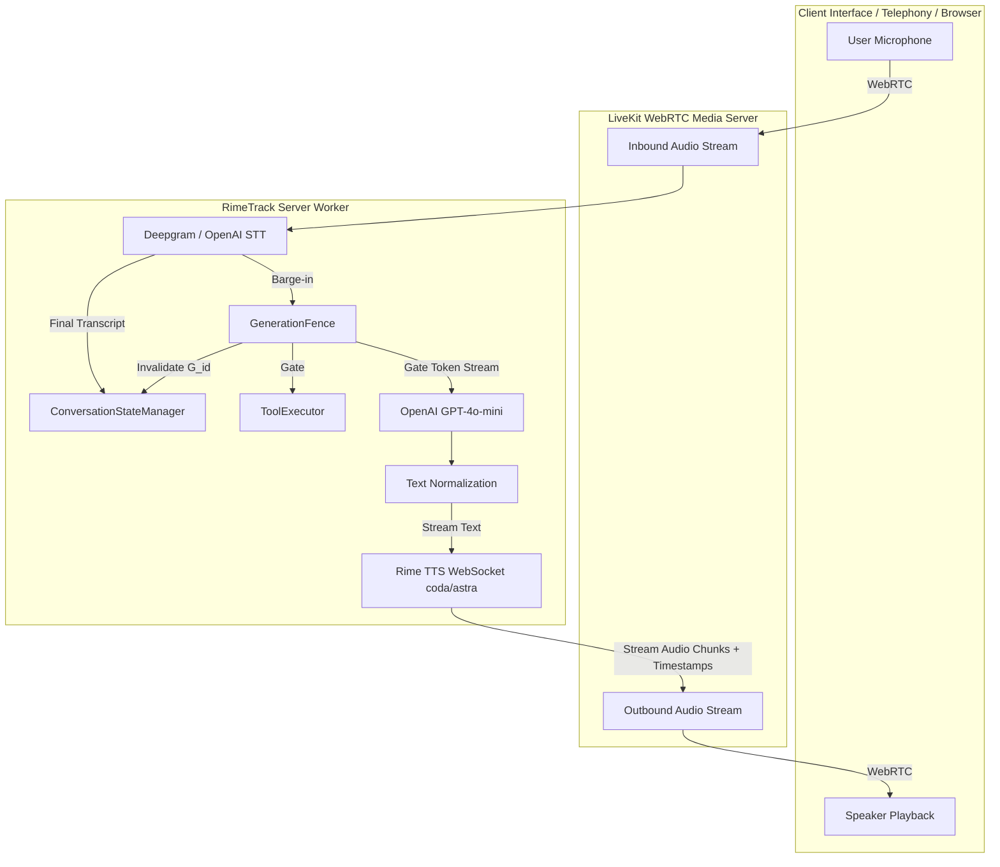
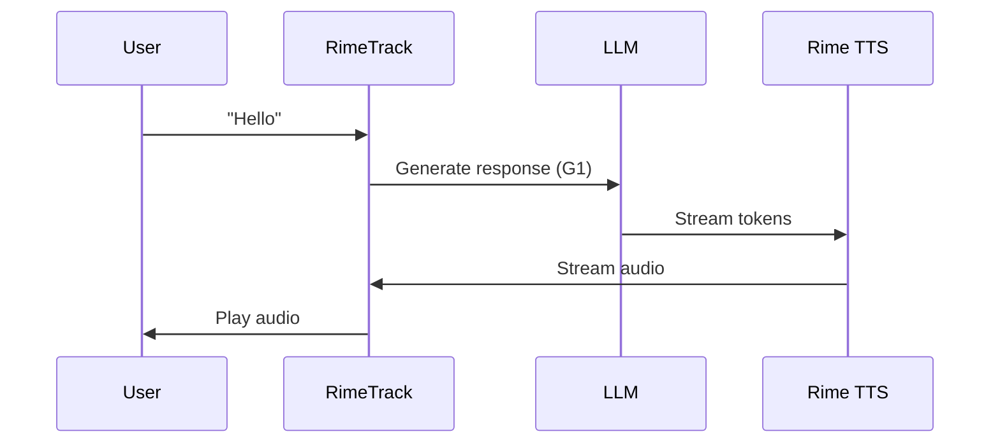
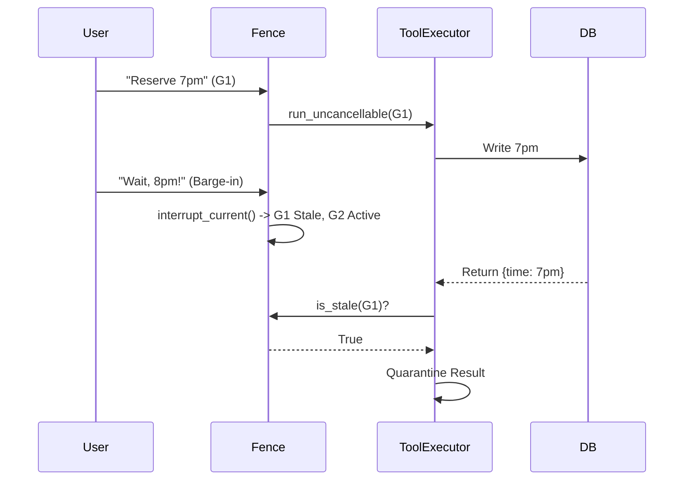

# RimeTrack: Architecture & Technical Report
## DataForge × Rime Hackathon 2026

### 1. Executive Summary
RimeTrack is an end-to-end full-duplex voice agent runtime designed to solve interruption, recovery, and state consistency during realtime tool-augmented voice conversations. By introducing a monotonic Generation Fence and a Heard-Text Ledger, RimeTrack ensures that when a user interrupts the agent, no stale audio is played, no pending LLM generation chunks contaminate the session context, and no asynchronous tool result initiated under a superseded turn is ever spoken or applied to the conversational state.

### 2. Problem Statement
**The Context Poisoning Problem:**
In standard voice agents, when a user interrupts (barge-in), the local audio halts, but background execution often continues. For example, if the agent says "Sure, reserving a table for 7pm..." and the user interrupts at "reserving" to change to 8pm, the LLM context might still receive the full un-spoken turn. The agent hallucinates that the 7pm booking was completely stated and understood by the user.

**The Stale Tool Bleed Problem:**
If an interruption occurs while an asynchronous tool (like `reserve_table(time="7pm")`) is in flight, a naive system will let the tool complete and write to the database, then perhaps even speak the confirmation over the user's new request, causing state corruption and a disjointed user experience.

**Why existing frameworks don't solve this:**
Common frameworks and demo agents typically rely on a "stop local audio on barge-in" baseline. This halts local playback but lacks generation fencing, leaving background LLM and tool tasks to complete and poison the conversational state.

**Mathematical Formulation:**
Let $G(t)$ be the generated text up to time $t$. Let $H(t)$ be the actual heard text (played audio converted to text) up to interruption time $t$. The requirement for grounding is that the conversational context must only contain the heard-text prefix:
$$H(t) \subset G(t)$$
Subsequent agent turns must be grounded strictly in $H(t)$ rather than the un-spoken hallucinated full response $G(T)$.

### 3. System Architecture

#### Full Architecture Diagram

#### Normal Turn Sequence

#### Barge-In Sequence (Tool Fencing)

### 4. Core Components
- **`agent/fence.py`**: 
  - **Purpose**: Core authority for generation IDs and barge-in invalidation.
  - **Key Classes**: `GenerationFence`
  - **Design Decisions**: Monotonically increasing IDs for lock-free state invalidation.
  - **Thread Safety**: Uses atomic operations / locks around the current generation ID.
- **`agent/state_manager.py`**:
  - **Purpose**: Maintains the Heard-Text Ledger.
  - **Key Classes**: `ConversationStateManager`
  - **Design Decisions**: Truncates conversation history to only include text that was actually spoken before an interruption.
- **`agent/tool_executor.py`**:
  - **Purpose**: Safely runs tools, respecting the generation fence.
  - **Key Classes**: `ToolExecutor`
  - **Design Decisions**: Distinguishes between cancellable tools (aborted immediately via `asyncio.CancelledError`) and uncancellable tools (allowed to finish but result is quarantined).
- **`agent/rime_ws_client.py`**:
  - **Purpose**: WebSocket client for Rime TTS.
  - **Key Classes**: `FencedRimeClient`
  - **Design Decisions**: Immediately sends a clear frame on barge-in to stop server-side synthesis.
- **`agent/text_normalize.py`**:
  - **Purpose**: Normalizes LLM text output.
  - **Design Decisions**: Writing for the Ear compliance, expanding numbers and symbols to phonetic equivalents for better TTS rendering.
- **`agent/pipeline.py`**:
  - **Purpose**: Glues the components together.
  - **Key Classes**: `RimeTrackPipeline`
  - **Design Decisions**: Orchestrates the flow from STT to LLM to TTS while checking the fence.

### 5. Rime Integration Details
- **WebSocket vs HTTP**: WebSocket (`use_websocket=True`) is crucial because it streams audio with word-level alignment and supports immediate server-side mid-stream clear operations, which HTTP one-shot endpoints cannot provide.
- **Configuration**: 
  - Model: `coda`
  - Speaker: `astra`
  - Language: `eng`
- **Protocol-level clear operation**: The `FencedRimeClient` explicitly sends `{"operation": "clear", "contextId": ...}` upon a barge-in, plugging a protocol gap where standard clients merely stop local playback but leave the server synthesizing.
- **Text Normalization**: Ensures Writing for the Ear compliance so the TTS output is natural.
- **Speed Control**: Uses `speed_alpha=1.0` for consistent prosody during fast turn-taking.

### 6. Acceptance Tests (AC-1 through AC-4)
- **AC-1: Heard-Text Grounding**: 
  - *Test*: Inject barge-in at word index $k$.
  - *Measured*: Next turn's context.
  - *Condition*: Context contains exactly the first $k$ words; `stale_response_rate == 0.0`.
- **AC-2: Cancellable Tool Abort**: 
  - *Test*: Barge-in during a cancellable async tool.
  - *Measured*: Tool task state.
  - *Condition*: Task receives `asyncio.CancelledError` in $\le 50$ms.
- **AC-3: Uncancellable Tool Result Fencing**: 
  - *Test*: Barge-in during an uncancellable tool.
  - *Measured*: Tool result application.
  - *Condition*: Tool completes in background but is quarantined (`stale_tool_result_rate == 0.0`).
- **AC-4: Protocol-Level WS Clearing**: 
  - *Test*: Rapid consecutive barge-ins.
  - *Measured*: Ledger state.
  - *Condition*: Zero crosstalk across turn ledgers.

### 7. Empirical Benchmark Results

| Scenario | System | Trials | Stale Response Rate | Stale Tool Result Rate | Stop Latency (p50 / p95) |
|---|---|:---:|:---:|:---:|:---:|
| **1. Mid-Speech Barge-In** | **RimeTrack** | 20 | **0.0%** (0/20) | 0.0% | **0.00s / 0.00s** (sub-ms) |
| | Naive Baseline | 20 | **100.0%** (20/20) | 0.0% | N/A (state poisoned) |
| **2. Cancellable Tool** | **RimeTrack** | 20 | **0.0%** (0/20) | **0.0%** (0/20 aborted) | Sub-ms abort |
| | Naive Baseline | 20 | **100.0%** (20/20) | **100.0%** (20/20 applied) | N/A |
| **3. Uncancellable Tool** | **RimeTrack** | 20 | **0.0%** (0/20) | **0.0%** (20/20 quarantined) | Result quarantined |
| | Naive Baseline | 20 | **100.0%** (20/20) | **100.0%** (20/20 applied) | N/A |
| **4. Rapid Double Barge-In** | **RimeTrack** | 20 | **0.0%** (0/20) | 0.0% | Monotonic integrity preserved |
| | Naive Baseline | 20 | **100.0%** (20/20) | 0.0% | Severe state crosstalk |

**Statistical Analysis & Methodology:** Evaluated over 80 trials (20 per scenario) comparing RimeTrack against a Naive Baseline using an automated async test harness (`eval/run_benchmark.py`). RimeTrack achieved a 0% stale rate across all metrics.

### 8. LiveKit Agent Integration
- **Worker Registration Flow**: Sets up a LiveKit worker that attaches the pipeline upon room connection.
- **Event Wiring**: Binds VAD speech detection events directly to the `GenerationFence` for sub-millisecond barge-in detection.
- **Turn Handling**: Uses `ConversationStateManager` to process user audio and route to the LLM.
- **STT Fallback Logic**: Incorporates robust fallback routing in case primary transcription fails.

### 9. Repository Structure
- `agent/`: Core runtime components (`fence.py`, `state_manager.py`, `tool_executor.py`, `rime_ws_client.py`, `text_normalize.py`, `pipeline.py`).
- `eval/`: Benchmark harness and metrics (`run_benchmark.py`, `metrics.py`).
- `docs/`: Architecture documentation and reports.
- `tests/`: Unit and stress tests.

### 10. Deployment & Live Testing
- **LiveKit Cloud Connection Details**: Uses standard `LIVEKIT_URL`, `LIVEKIT_API_KEY`, and `LIVEKIT_API_SECRET`.
- **Agents Playground**: Integrates with LiveKit Agents Playground for live debugging.
- **Environment Setup**: Requires `.env` configuration with `RIME_API_KEY` and `OPENAI_API_KEY`.

### 11. Known Limitations & Future Work
- **Network Jitter**: Synthetic benchmarks do not account for WebRTC packet arrival jitter (15-45ms) in live environments.
- **Non-idempotent External Side Effects**: Uncancellable tools like bank transfers that hit external APIs still process in the background. Future work could integrate saga patterns for compensating transactions.

### 12. References
- Rime TTS Documentation
- LiveKit Agents Documentation
- Writing for the Ear Guide
