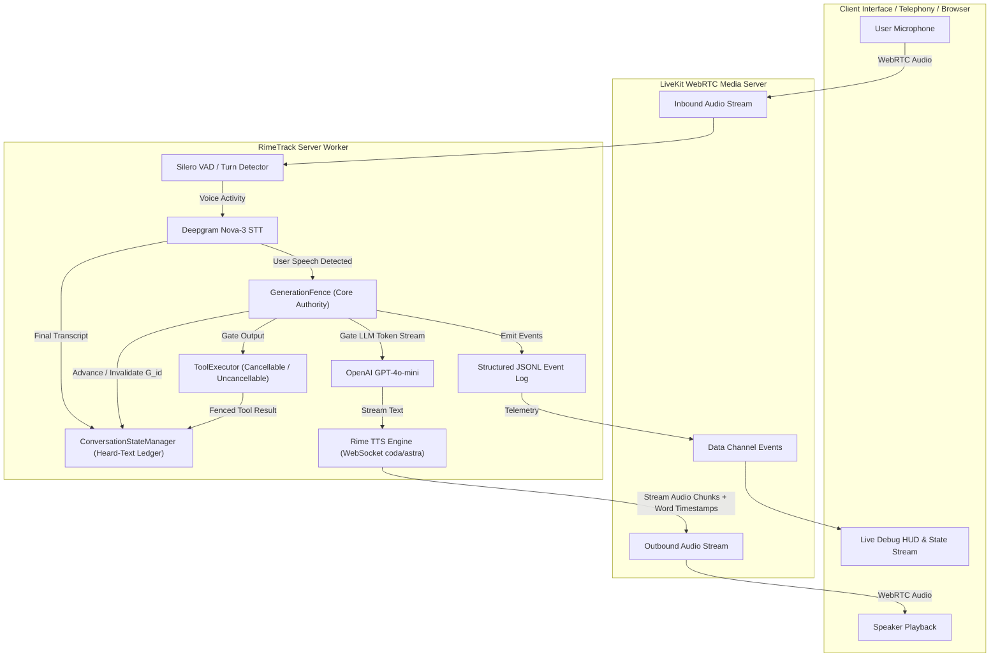
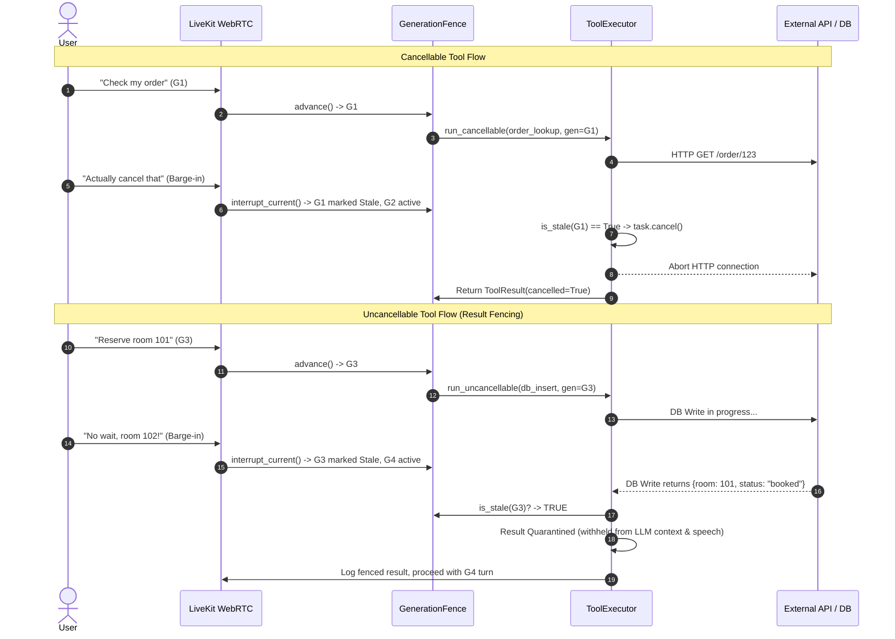

# RimeTrack Architecture Deep-Dive

RimeTrack is an end-to-end full-duplex voice agent runtime designed to solve **interruption, recovery, and state consistency** during realtime tool-augmented voice conversations.

---

## 1. High-Level System Architecture



---

## 2. The Core Problem: The Naive Baseline Failure

In standard voice agents (e.g., standard LangChain/LiveKit pipelines without fencing), interruptions trigger audio mute, but background execution continues unchecked:

```
[Agent Turn 1 (G1)]
User: "Book table for 7pm."
Agent: "Sure, reserving a table for 7pm at your usual place..."
LLM finishes generating: 10 words.
Tool called: reserve_table(time="7pm")  [Takes 500ms]

-- BARGE-IN --
User: "Wait, actually make it 8pm!"
Audio stops locally after word 3 ("Sure, reserving a").

-- NAIVE FAILURE --
1. Context Poisoning: The next LLM call receives the full un-spoken turn: "Sure, reserving a table for 7pm at your usual place...". The agent hallucinates that the 7pm booking was confirmed and understood by the user.
2. Tool Bleed: 300ms later, reserve_table(time="7pm") finishes and writes to DB, then speaks: "Your 7pm booking is confirmed!" over the user's 8pm request.
```

---

## 3. RimeTrack Solution: Generation Fence & Heard-Text Ledger

### 3.1 Monotonic Generation IDs
Every assistant turn is assigned a monotonically increasing ID (`G1`, `G2`, `G3`, ...).
At every step where data or audio attempts to cross into shared conversation state or playback, it must query `fence.is_current(generation_id)`.

### 3.2 Heard-Text Ledger (`ConversationStateManager`)
Rather than storing what the LLM generated, the ledger records what was **actually played aloud**:
- **WebSocket Native Path (Preferred):** Rime's WebSocket sends per-word `timestamps`. LiveKit's `ChatMessage.interrupted` contains the exact truncated text corresponding to the audio timestamp when the stop signal arrived.
- **Chunk-Flush Fallback Path:** If aligned timestamps are unavailable, RimeTrack's `record_chunk_played()` commits chunks at flush time. When interrupted, `truncate_on_interrupt()` freezes the history to the heard prefix.

### 3.3 Tool Execution Strategies (`ToolExecutor`)



---

## 4. State Machine Lifecycle

```mermaid
state_diagram
    [*] --> Idle: Session Started
    Idle --> Generating: User Speech Finished (ASR Final)
    Generating --> Speaking: Rime WS Audio Stream Starts
    Speaking --> Completed: Normal Turn Completion
    Completed --> Idle: Ready for Next Turn

    Speaking --> Interrupted: User Barge-In Detected
    Generating --> Interrupted: User Barge-In Detected
    Interrupted --> Quarantined: In-flight Tools / LLM fenced
    Quarantined --> Generating: New Turn (G_{n+1}) Grounded in Heard Prefix
```

---

## 5. Rime Integration Specifications

- **Endpoint:** Rime WebSocket Streaming Engine (`wss://users.rime.ai/v1/rime-ws`)
- **Model:** `coda` (Optimized for conversational latency and prosodic nuance)
- **Speaker:** `astra`
- **Language:** `eng`
- **Transport:** WebSocket (`use_websocket=True`), enabling streaming token push, synchronized word alignment timestamps, and server-side buffer flushing on interrupt.
- **Speed Control:** `speed_alpha=1.0` (WebSocket native speed scaling).
